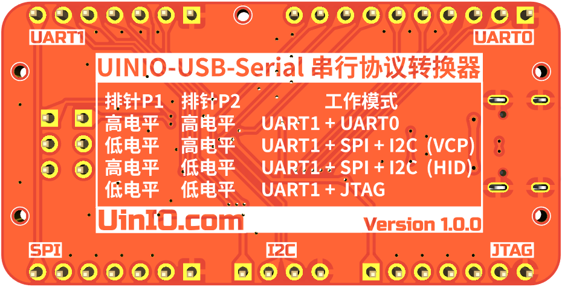

# UINIO-USB-Serial 串行协议转换器

[**UINIO-USB-Serial**](https://github.com/uinika/UINIO-USB-Serial) 是一款基于**沁恒**高速 USB 2.0 转接芯片 [**CH347T**](https://www.wch.cn/products/CH347.html) 的 USB 串行协议转换工具，支持 USB 接口转 `GPIO`、`UART`、`I²C`、`SPI`、`JTAG`, 可以用于调试 3.3V 电平的微控制器与外设的通信，也可以配合使用 [UINIO-Signal-Translator](https://github.com/uinika/UINIO-Signal-Translator) 完成 `3.3V` 到 `1.8V` 的高速信号转换，从而实现对 FPGA 芯片的调试与下载。

## 工作模式简介

**UINIO-USB-Serial** 可以支持下面的四种工作模式：

1. **USB ➞ UART**：支持两路 UART 串行接口，每一路的波特率最高可以达到 `9Mbps`。
2. **USB ➞ I²C**：处于 I²C 主设备模式，支持 4 种传输速度。
3. **USB ➞ SPI**：处于 SPI 主设备模式，最高频率可以达到 `36MHz`，并且支持 2 路片选信号线，可以分时操作两个 SPI 从设备。
4. **USB ➞ JTAG**：支持标准四线 JTAG 协议，最高频率可以达到 `18Mbit/s`。

## 工作模式配置

这些模式分别由 **CH347T** 的 `DTR1` 和 `RTS1` 引脚的电平状态进行控制：

| 排针 P1  | 排针 P2  | 工作模式                |
| -------- | -------- | ----------------------- |
| `低电平` | `低电平` | UART1 + JTAG            |
| `高电平` | `高电平` | UART1 + UART0           |
| `高电平` | `低电平` | UART1 + SPI + I2C (HID) |
| `低电平` | `高电平` | UART1 + SPI + I2C (VCP) |
